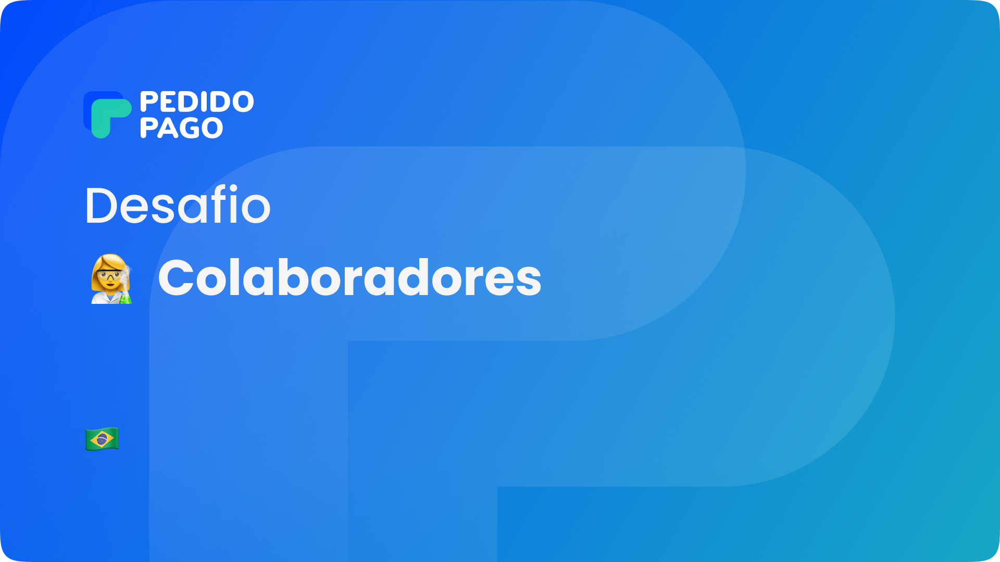
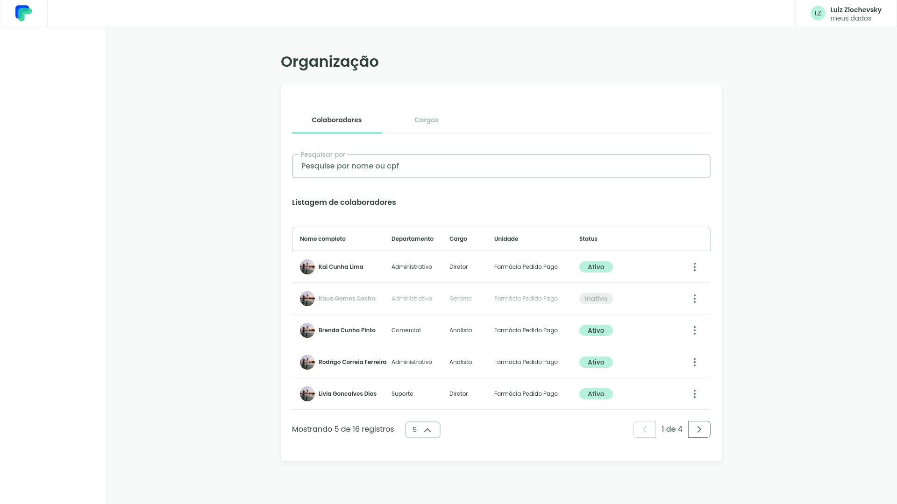
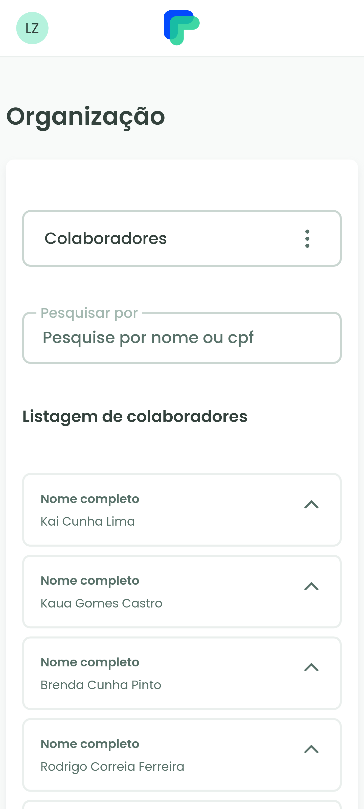

    

> 👨‍💻️ Desafio Front end Web - Pedido Pago

    
    

### 💻 Principais techs

- Nextjs
- TypeScript
- Emotion
- Axios
- Jest
- React Testing Library

[Deploy](https://challenge-pedido-pago-ten.vercel.app/)
